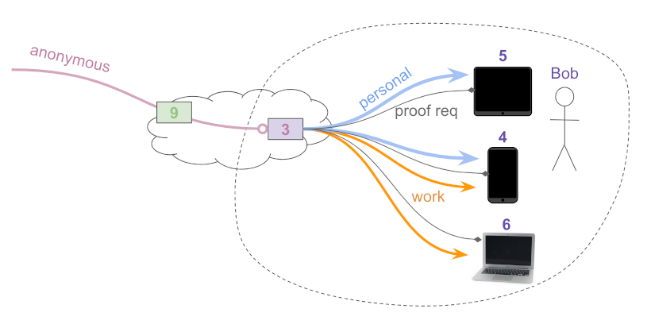

# 00?? Cooperative Disclosure
- Author: Daniel Hardman <daniel.hardman@gmail.com> 
- Start Date: 2019-02-08
- PR: (leave this empty)

## Summary
[summary]: #summary

Explain how agents at the edge can cooperate to deliberately disclose
limited information to other agents (e.g., routing agents) in the
communication path.

## Motivation
[motivation]: #motivation

We expect messages to be routed to the edge of sovereign domains in
many cases. However, routing agents in the cloud are a logical place
to implement policy--and to implement policy, they may need limited
visibility into the semantics of interactions as they unfold. The
messages they forward can't be maximally opaque. We need a way to
disclose just enough metadata, and we need it to be interoperable,
safe, and well understood.

## Tutorial
[tutorial]: #tutorial

Suppose Bob has a fancy cloud agent, `3`, that routes messages to his mobile
phone, his laptop, and his tablet. He wants to use the routing agent to
filter and triage messages. When messages are work-related, he wants
them delivered to his phone and laptop; when they are personal, he
wants them delivered to his phone and tablet. Bob wants proof requests
requests delivered to all his devices. And Bob wants unsolicited messages
from unknown senders (e.g., anonymous love letters) to be held by his
routing agent until he feels like retrieving them.



The default posture in agent-to-agent communication is maximum
privacy, and minimal trust in a routing agent in the cloud that could
be hacked or co-opted by a malicious sysadmin. If this posture isn't
modified, then the `forward` messages received by routing agent `3`
will not contain enough information for most of these policies to be
enforced. (The exception will be the policy about anonymous senders;
the use of anoncrypt mode is visible to a forwarder by inspecting
[the `alg` header inside the `protected` section of a wire message](
https://github.com/hyperledger/indy-hipe/tree/master/text/0028-wire-message-format#pack_message-return-value-anoncrypt-mode).)

To solve this problem, agents that send messages to Bob should
include a `disclose` block at the root of `forward` messages that Bob's
routing agent `3` sees. 

```JSON
{

"disclose": {
  "@type": "
}
```
 

## Reference
[reference]: #reference

Provide guidance for implementers, procedures to inform testing,
interface definitions, formal function prototypes, error codes,
diagrams, and other technical details that might be looked up.
Strive to guarantee that:

- Interactions with other features are clear.
- Implementation trajectory is well defined.
- Corner cases are dissected by example.

## Drawbacks
[drawbacks]: #drawbacks

Why should we *not* do this?

## Rationale and alternatives
[alternatives]: #alternatives

- Why is this design the best in the space of possible designs?
- What other designs have been considered and what is the rationale for not
choosing them?
- What is the impact of not doing this?

## Prior art
[prior-art]: #prior-art

Discuss prior art, both the good and the bad, in relation to this proposal.
A few examples of what this can include are:

- Does this feature exist in other SSI ecosystems and what experience have
their community had?
- For other teams: What lessons can we learn from other attempts?
- Papers: Are there any published papers or great posts that discuss this?
If you have some relevant papers to refer to, this can serve as a more detailed
theoretical background.

This section is intended to encourage you as an author to think about the
lessons from other implementers, provide readers of your proposal with a
fuller picture. If there is no prior art, that is fine - your ideas are
interesting to us whether they are brand new or if they are an adaptation
from other communities.

Note that while precedent set by other communities is some motivation, it
does not on its own motivate an enhancement proposal here. Please also take
into consideration that Indy sometimes intentionally diverges from common
identity features.

## Unresolved questions
[unresolved]: #unresolved-questions

- What parts of the design do you expect to resolve through the
enhancement proposal process before this gets merged?
- What parts of the design do you expect to resolve through the
implementation of this feature before stabilization?
- What related issues do you consider out of scope for this 
proposal that could be addressed in the future independently of the
solution that comes out of this doc?
